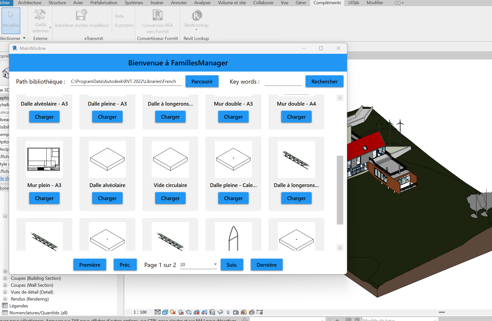

# FamillesManager
FamillesManager for Revit / Gestionnaire de Familles pour Revit

Overview

FamiliesManager is a sophisticated WPF MVVM desktop plugin built for Autodesk Revit that revolutionizes how users browse, search, and load Revit family files (.RFA). It replaces the cumbersome, text-based Revit built-in browser with an intuitive, visual, and efficient modern interface, significantly improving the user experience and productivity for architects and BIM modelers.

Features

•	Family Browsing: Navigate through folders containing Revit family files
•	Thumbnail Preview: Visual preview of each family with icons
•	Search Functionality: Find families by name using keywords
•	Pagination: Organize large collections of families across multiple pages
•	One-Click Loading: Load selected families directly into your Revit project
•	Modern UI: Clean, Material Design-inspired interface

Installation

•	Build the project in Visual Studio
•	Copy the generated .dll file to your Revit add-ins folder
•	Restart Revit (if it was running)
•	Find the plugin in the Revit Add-Ins tab

Usage

•	Launch Revit and open a project
•	Navigate to the Add-Ins tab and click on FamillesManager
•	Use the "Parcourir" button to select a folder containing .rfa files
•	Browse families using the pagination controls at the bottom
•	Use the search box to filter families by name
•	Click "Charger" on any family to load it into your Revit project
•	Place the family in your project as you normally would

Technical Stack:

•	Languages: C#, XAML
•	Frameworks: .NET Framework, WPF, MVVM Pattern
•	APIs: Autodesk Revit API, RevitStorage API
•	Libraries: Material Design In XAML Toolkit, Windows Forms Integration

Requirements

•	Autodesk Revit 2018 or newer
•	.NET Framework 4.8
•	Windows 10 or newer
──────────────────────────────────────────────────

Aperçu

FamillesManager est un plugin desktop WMV MVVM sophistiqué développé pour Autodesk Revit qui révolutionne la façon de parcourir, rechercher et charger les fichiers de familles Revit (.RFA). Il remplace le navigateur intégré fastidieux et textuel de Revit par une interface moderne, intuitive et visuelle, améliorant significativement l'expérience utilisateur et la productivité des architectes et modeleurs BIM.

Fonctionnalités

•	Parcours des familles: Naviguez dans les dossiers contenant des fichiers de famille Revit
•	Aperçu miniature: Visualisation de chaque famille avec des icônes
•	Fonction de recherche: Trouvez des familles par nom à l'aide de mots-clés
•	Pagination: Organisez de grandes collections de familles sur plusieurs pages
•	Chargement en un clic: Chargez les familles sélectionnées directement dans votre projet Revit
•	Interface moderne: Interface épurée inspirée de Material Design

Installation

•	Compilez le projet dans Visual Studio
•	Copiez le fichier .dll généré dans votre dossier de modules complémentaires Revit
•	Redémarrez Revit (s'il était en cours d'exécution)
•	Trouvez le plugin dans l'onglet Modules complémentaires de Revit

Utilisation

•	Lancez Revit et ouvrez un projet
•	Accédez à l'onglet Modules complémentaires et cliquez sur FamillesManager
•	Utilisez le bouton "Parcourir" pour sélectionner un dossier contenant des fichiers .rfa
•	Parcourez les familles à l'aide des contrôles de pagination en bas
•	Utilisez la zone de recherche pour filtrer les familles par nom
•	Cliquez sur "Charger" sur n'importe quelle famille pour la charger dans votre projet Revit
•	Placez la famille dans votre projet comme vous le feriez normalement

Stack Technique :

•	Langages : C#, XAML
•	Frameworks : .NET Framework, WPF, Pattern MVVM
•	APIs : Autodesk Revit API, API RevitStorage
•	Bibliothèques : Material Design In XAML Toolkit, Windows Forms Integration

Exigences

•	Autodesk Revit 2018 ou plus récent
•	.NET Framework 4.8
•	Windows 10 ou plus récent

